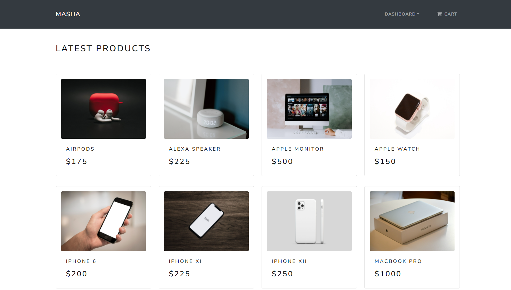
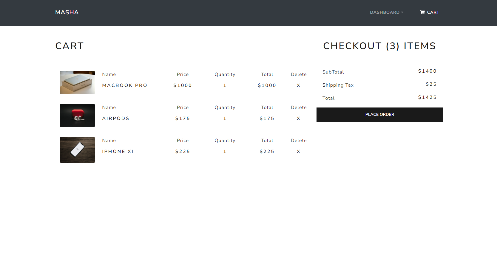
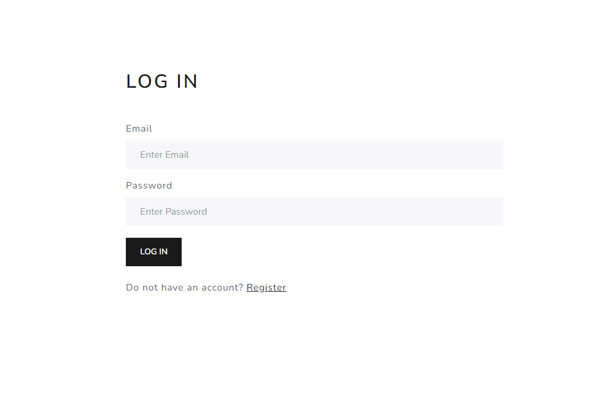
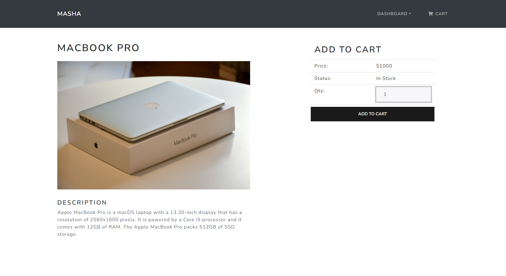

# Documentation



## Description

This site is a digital store where customers can view various products from different fields, adding them to the cart, and even ordering in case they want. The site was built in order to evolve my programming skills, to work with a database, backend and frontend at the same time. I chose a MERN package for this project, MongoDB as the database, Express as the framework for the backend created with NodeJS, and React JS for frontend.  Also, I used Redux for state management.


## Features

### User Experience

- A customer can see all the products on the site, by clicking on any of them will be directed to a dedicated page for each product. Furthermore, if the customer wants to save it in the cart, he will have to log in or register on the platform, in case he does not have an account yet. 
- After authentication, he will have access to several functions, for example the page {{URL}}/profile where he will be able to view all his orders or to be able to edit his own information in case he made a mistake in the registration (all except email because this is a unique field).
- He will also be able to place orders if he wants some products on the site. After filling in the fields on the checkout page, it will be redirected to the /profile page where he will can see in detail the invoice where it will be all the useful information, such as order date, total price, processing fees, products purchased etc.

### Developer Experience

- The site is designed on a MERN stack, so I used MongoDB where I created four tables for users, products, shopping carts and orders. All tables are linked together to avoid data loss and errors. 
- Almost all routes need JWT Auth Middleware to improve security and restrict access to users who do not have an account on the platform, as they are not allowed on pages such as /cart or /profile.
- All state management was made using Redux
- All data was fetching from db with axios and stored to redux store with help of actions. Also, all reducers have 3 main case, loading, error and the main info. I approached this strategy in order to attract the attention of people who use the application through a loading spinner (component taken from the bootstrap) until the data is taken in full and can be available on the site.
- When the user places an order, the cart is emptied, a new order is registered both in the database and in his account (/profile page). Also, the stock for the respective product or products will be updated.

## Usage

### Env Variables

Create .env file in then root and add the following

```
PORT = xxxx ( e.g 5000 )
PROJECT_TYPE = xxxx ( You have to choose between 'production' and 'development' )
MONGO_URI = YOUR_MONGO_URI
JWT_SECRET = YOUR_JWT_SECRET
```

### Install Dependencies

```
npm install
```

### Run The Application

#### Run backend + frontend
```
npm run dev 
```

#### Run backend
```
npm run server 
```

#### Run frontend
```
npm run client
```

## Gallery





## License

The MIT License

Copyright (c) 2021 Dumitrache Florentin

Permission is hereby granted, free of charge, to any person obtaining a copy of this software and associated documentation files (the "Software"), to deal in the Software without restriction, including without limitation the rights to use, copy, modify, merge, publish, distribute, sublicense, and/or sell copies of the Software, and to permit persons to whom the Software is furnished to do so, subject to the following conditions:

THE SOFTWARE IS PROVIDED "AS IS", WITHOUT WARRANTY OF ANY KIND, EXPRESS OR IMPLIED, INCLUDING BUT NOT LIMITED TO THE WARRANTIES OF MERCHANTABILITY, FITNESS FOR A PARTICULAR PURPOSE AND NONINFRINGEMENT. IN NO EVENT SHALL THE AUTHORS OR COPYRIGHT HOLDERS BE LIABLE FOR ANY CLAIM, DAMAGES OR OTHER LIABILITY, WHETHER IN AN ACTION OF CONTRACT, TORT OR OTHERWISE, ARISING FROM, OUT OF OR IN CONNECTION WITH THE SOFTWARE OR THE USE OR OTHER DEALINGS IN THE SOFTWARE.
